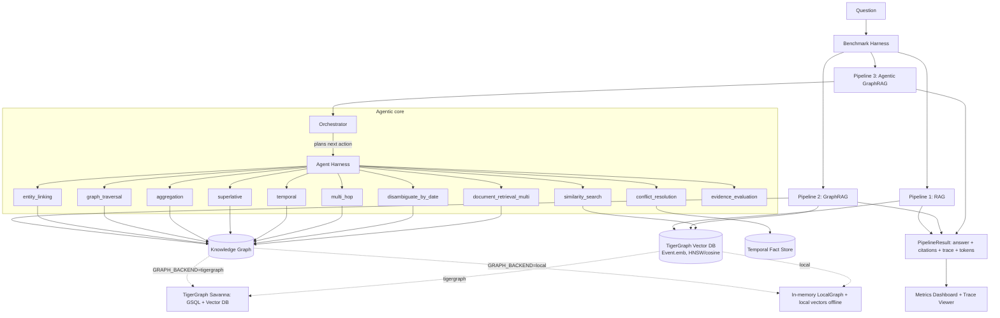
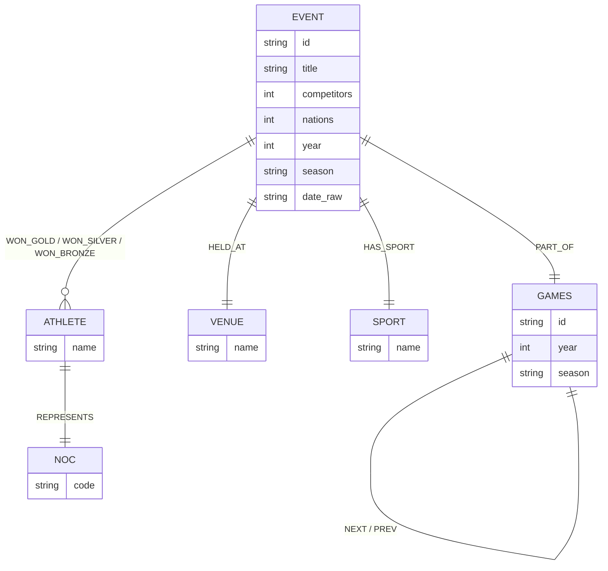
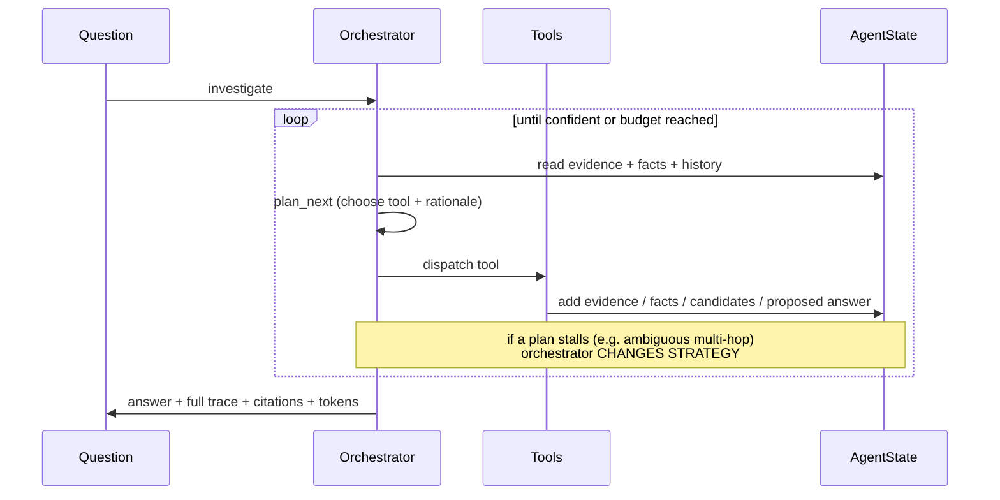

# Architecture

## System overview

On TigerGraph, both the graph and the vector store are the **same database**,
reached with **one connection / one secret**. The vector store is the
`Event.emb` attribute searched by the installed `event_vector_search` GSQL
query (`vectorSearch()`, HNSW, cosine).

## Knowledge graph ontology

## The agentic loop

## Why the design maps to the scoring

| Criterion | Where it lives |
|---|---|
| Investigation accuracy (30%) | Graph-grounded traversals per intent; agentic disambiguation |
| Evidence quality & explainability (15%) | `TraceStep` per action + citations with source URLs; `explain` trace viewer |
| Agentic effectiveness & efficiency (15%) | Orchestrator escalates only when needed; `accuracy_per_1k_tokens` |
| Design, engineering & code quality (15%) | Pluggable backends, uniform `PipelineResult`, tests, reproducible offline |
| Innovation (15%) | Exact single-day disambiguation, bi-temporal conflict store, TigerGraph hybrid graph+vector |
| Presentation & Q&A (10%) | Dashboard + trace viewer + demo script |

## TigerGraph Savanna setup (one-time)

The graph and vector store are created and loaded in five steps. GSQL lives in
`tigergraph/`; loaders live in `scripts/`.

| Step | Command / file | What it does |
|---|---|---|
| 1. Schema | `tigergraph/01_schema.gsql` (Query Editor) | 6 vertex types + 9 edge types on graph `AgenticGraphRAG` |
| 2. Load graph | `scripts/tigergraph_ingest.py` then `scripts/tigergraph_load.py` | generate CSVs, upsert ~7.8k vertices + ~18k edges |
| 3. Vector attribute | `scripts/tigergraph_add_vector_attr.py` (or `tigergraph/02_vector_attribute.gsql`) | add `Event.emb(DIMENSION=384, METRIC="COSINE")` |
| 4. Load vectors | `scripts/tigergraph_load_vectors.py` | embed 2,187 events, upsert vectors |
| 5. Vector query | `scripts/tigergraph_install_vquery.py` (or `tigergraph/03_vector_query.gsql`) | install `event_vector_search` |

`scripts/tigergraph_verify.py` confirms counts + a sample traversal.
Connection uses `TG_HOST` + `TG_SECRET` from `.env` (Savanna gsqlSecret auth).
